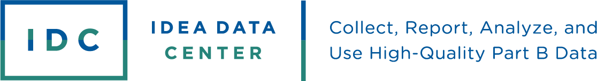

<!-- README.md is generated from README.Rmd. Please edit that file -->

# IDC NRBA App 

The IDC NRBA App is an interactive, browser-based application that can
be used to analyze survey data with respect to response rates,
representativeness, and nonresponse bias. Use the IDC NRBA App to answer
questions such as:

- What are our response rates and do they differ across subgroups?

- Are some subgroups in the population overrepresented or
  underrepresented in our respondent data?

- How do survey outcomes differ across subgroups?

- Can statistical adjustments reduce nonresponse bias in our data?

The IDC NRBA App consists of three modules that guide the user though
analysis and reporting.

- Setup: Load a prepared data set(s) into the application

- Analysis: Select and configure specific analyses to run, and view the
  results

- Report: Export output tables summarizing the analyses into an Excel
  file

## Installation

You can install the released version of ‘idcnrba’ from
[CRAN](https://CRAN.R-project.org) with:

``` r
install.packages("idcnrba")
```

To run this application, the user must have Pandoc installed. To ensure
that Pandoc is installed and available, we recommend that the user run
the app through RStudio, which includes a bundled installation of
Pandoc.

## Usage

To launch the app, run the following code in R.

``` r
library(idcnrba)

launch_app()
```

Within RStudio, the app can also be launched from the ‘Addins’ menu.
